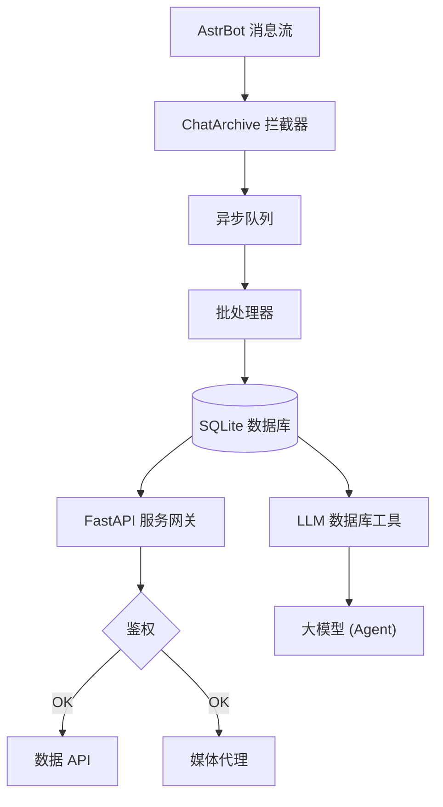

# ⚡ AstrBot Chat Archive Plugin (聊天消息存档插件)

<p align="center">
  
</p>

<p align="center">
  <strong>为 <a href="https://docs.astrbot.app/">AstrBot</a> 打造的高性能聊天消息存档与暗黑风 Web 可视化面板插件。</strong>
</p>

<p align="center">
  
  
  
</p>

> 本插件是一款面向 [AstrBot](https://docs.astrbot.app/) 的聊天记录存档工具。它在后台静默接收并持久化群组与私聊消息，同时提供一个内置的 Web 管理面板，用于历史消息的浏览、检索与数据分析。所有数据均存储于本地 SQLite 数据库，无需依赖外部服务。

> [!WARNING]
> **⚠️ 安全与隐私重要提示**：本插件涉及敏感聊天记录的本地持久化存储。为了保障您的数据隐私安全，**请务必在插件配置中为内置 Web 服务设置一个高度随机的强密码 (`api_key`)**。切勿暴露在公网且不设防，以防聊天隐私数据泄露。

## ✨ 功能特性

* 🚀 **异步无感知消息存档**：采用独立的异步消息队列，消息由后台批量写入数据库，对机器人主流程零阻塞、零影响。
* 📊 **全局可视化总览看板 (Dashboard)**：全新设计的全局可视化数据大屏，实时展现多维指标、SVG 发言活跃趋势折线图、消息类型分布及群聊活跃排行。
* 🔍 **全站路由与全局搜索**：支持浏览器前进后退与 `?session_id` 状态深度同步。未选择特定会话时，可在总览面板直接执行跨会话的全局搜索。
* 🖼️ **媒体文件本地缓存**：支持将图片、视频等媒体文件下载并缓存至本地，彻底解决 QQ 原图过期失效与防盗链问题。
* 🧠 **为大模型提供长期记忆**：向 LLM Agent 注册数据库检索工具，使模型能够自主查询任意时间段的历史消息，有效突破上下文长度限制。
* 🔌 **插件扩展友好**：提供开放的 Web 路由挂载接口，其他插件可便捷地在本插件的 Web 服务上注册自定义 API 端点。


---

### 消息搜索

- 输入 `手机 充电`：匹配同时包含两个词的同一条消息，词序不限；空格、换行和全角空格均可分隔关键词。
- 输入 `"手机 充电"`：匹配连续短语，保留短语内部的空格。也可组合使用，如 `"server error" 修复`。
- 链接、编号、`%`、`_` 等仍按普通文本匹配；结果保持原有顺序，会话、成员和时间筛选继续生效。
- 搜索复用现有 FTS5 索引，不修改归档原文或数据库结构。不进行同义词、错字或全半角自动扩展。

## 🛠️ 安装方法

1. 进入 AstrBot 插件目录并克隆本仓库：
   ```bash
   cd /path/to/AstrBot/data/plugins
   git clone https://github.com/YukiNo420/astrbot_plugin_chat_archive.git
   cd astrbot_plugin_chat_archive
   ```
2. 安装 WebUI 依赖：
   ```bash
   python3 -m pip install -r requirements.txt
   ```
3. 在 AstrBot 后台配置安全的 `api_key`，然后重启 AstrBot 完成初始化。

---

## ⚙️ 配置说明

### 基础设置（`basic`）

| 配置项 | 默认值 | 说明 |
| :--- | :--- | :--- |
| `enable_archive` | `true` | 是否实时记录聊天消息到数据库中。 |
| `ignored_users` | `[]` | 不希望被记录的用户 ID 列表（如机器人自身的 QQ 号）。 |
| `cache_media` | `false` | 是否开启媒体本地缓存。 |
| `allowed_media_domains` | QQ 媒体域名白名单 | 允许缓存/代理的媒体域名及其子域名，防止 SSRF 访问内网。 |
| `allow_fake_ip` | `true` | 是否放行由 Clash/Mihomo 等代理软件 Fake-IP 模式解析出的保留网段 (`198.18.0.0/15`)，防止局域网安全策略的意外拦截。 |
| `media_max_mb` | `50` | 单个媒体缓存/代理的最大体积，范围 1–200 MB。 |
| `enable_clean` | `false` | 是否定期自动清理过期的媒体缓存文件。 |
| `clean_days` | `30` | 开启 `enable_clean` 和 `allow_cache_eviction` 后，按此天数清理过期缓存。 |
| `allow_cache_eviction` | `false` | 是否允许自动淘汰已有缓存。默认保留附件，空间不足时拒绝新缓存。 |
| `media_cache_max_mb` | `10240` | 缓存总配额，单位 MiB。 |
| `db_path` | `""` | 自定义数据库路径，支持环境变量与 `~` 展开，留空使用默认位置。 |
| `sqlite_journal_mode` | `WAL` | SQLite 日志模式。NAS/NFS/SMB 等网络盘可尝试 `DELETE`。 |
| `sqlite_max_connections` | `10` | SQLite 连接池最大连接数，范围 2-64。 |

### WebUI 面板设置（`web_server`）

| 配置项 | 默认值 | 说明 |
| :--- | :--- | :--- |
| `enable` | `true` | 是否启用内置 Web 服务。独立部署时应设为 `false` 以避免端口冲突。 |
| `host` | `127.0.0.1` | Web 监听地址。公网访问请配合强随机 `api_key` 与防火墙使用。 |
| `port` | `8090` | Web 服务端口。 |
| `api_key` | `""` | WebUI 访问密码，启用面板前必须设置。留空时拒绝未鉴权访问。 |

### 环境变量覆盖

| 环境变量 | 说明 |
| :--- | :--- |
| `ARCHIVE_API_KEY` | 覆盖 WebUI API Key。 |
| `ARCHIVE_HOST` / `ARCHIVE_PORT` | 覆盖 WebUI 监听地址与端口。 |
| `ARCHIVE_DB_PATH` | 覆盖 SQLite 数据库路径。 |
| `ARCHIVE_DATA_DIR` | 覆盖插件数据目录。 |
| `ARCHIVE_CONFIG_PATH` | 覆盖 AstrBot 插件配置 JSON 路径。 |
| `ARCHIVE_ALLOWED_MEDIA_DOMAINS` | 逗号分隔的媒体域名白名单。 |
| `ARCHIVE_ALLOW_FAKE_IP` | 覆盖是否放行 Fake-IP 保留网段。 |
| `ARCHIVE_MEDIA_MAX_MB` | 覆盖单个媒体最大体积。 |
| `ARCHIVE_SQLITE_JOURNAL_MODE` | 覆盖 SQLite 日志模式。 |
| `ARCHIVE_SQLITE_MAX_CONNECTIONS` | 覆盖 SQLite 连接池最大连接数。 |
| `ARCHIVE_CORS_ORIGINS` | 逗号分隔的允许跨域来源。 |

---

## 合并转发中的嵌套和文件

### 消息管理与保留

登录 Web 后，进入“设置 → 消息管理”并选择会话，可按开始、结束时间筛选，范围会自动预览。手动导出、删除和恢复覆盖整个选定范围，没有 500 条上限。删除前需再次确认；预览后新到消息保留，消息发生编辑时需重新预览。预览 5 分钟后失效，只能确认一次，并绑定当前登录会话；重新登录或重启 Web 后需要重新预览。

默认删除方式是移入回收站，记录退出历史、搜索、AI 检索和统计，可在同一面板恢复。原 ID 被占用或数据库字段变化时拒绝整批恢复，避免覆盖或部分恢复。可选“永久删除消息”需二次确认并输入“永久删除”，会从消息表删除本批记录，无法从回收站恢复；这不等于 SQLite 文件安全擦除或磁盘立即回收。

预览后可先下载本批消息的 JSON 备份，包含原记录字段，不包含附件。导出不会删除消息，也不提供 JSON 自动导入；永久删除后的恢复须自行核对备份。缓存附件在两种删除方式下均保留。不能凭数据库当前引用数清理附件，因为写入队列和正在处理的媒体可能尚未入库。本功能不物理回收附件。既有 `enable_clean` 缓存清理是独立选项，只有同时开启 `allow_cache_eviction` 才会删除过期附件。

管理页显示会话和回收站消息数量。空闲页可由 SQLite 重用，不表示文件已经缩小；不自动执行 `VACUUM`。回收站不自动清空，也不保证磁盘占用下降。

已完成、尚未投入使用的离线迁移包可用 [缓存引用只读预览](contrib/CACHE_REFERENCE_PREVIEW.md) 检查正常消息、回收站、嵌套内容和已落盘失败队列中的缓存路径。“未观察到引用”不是可安全回收的判定；工具没有隔离或删除入口，不改变现有 Web 的附件统计。

`basic.message_retention_days` 默认为 `0`（禁用），可设为 30、90 或其他正整数天数。`message_retention_sessions` 是完整会话 ID 白名单；`message_retention_global` 默认为 `false`，此时空白名单不处理任何会话。显式开启全局范围后，空白名单表示所有会话，非空白名单仍限定范围。`message_retention_excluded_sessions` 排除名单优先于两种范围。插件在启动约 5 秒后及此后每日处理严格早于截止时间的记录，每会话每轮最多 500 条，始终移入回收站；关闭插件会停止开始新的批次。独立 Web 进程不执行自动保留。默认配置不会自动删除消息。

全局搜索中的消息显示来源链接，可通过侧栏归档入口返回主面板。历史数据缺少来源信息时归入 `legacy:archive`，无法凭空恢复原来的群来源。

### 媒体显示与 Web 启动排查

会话列表中的 `[图片]` / `[视频]` 是摘要；打开会话后才加载媒体。详情中的媒体加载失败时也会退回标签。带查询参数的媒体链接会按 HTML 与 CQ 两层分别解码，保留原始签名参数；升级后前端脚本版本号会更新。

开启缓存时，新归档的图片/视频链接应为 `/static/cache/...`。该路径需要登录后的会话 Cookie 或 `X-API-Key`，未登录返回 401，缓存文件缺失返回 404。只看缓存目录有文件无法判断某条记录是否引用它；旧记录不会自动重新下载或回填。

Docker 更新后 Web 拒绝连接时，请先查看启动日志：缺少 Web 依赖、端口冲突和应用启动失败现在会明确记录，`startup requested` 仅表示已请求启动。确认在新镜像的 AstrBot Python 环境中安装了 `requirements.txt`；需要容器外访问时，容器内监听配置应为 `0.0.0.0`，并发布对应端口。数据库自定义路径须是容器内可写路径，父目录会自动建立；宿主机路径需先挂载到容器。

这些检查不能保证特定 Docker 镜像升级已通过，也不能恢复已被覆盖的旧归档。升级前仍应备份完整数据目录，避免通过重装插件排查而丢失插件目录内的旧数据。

新归档为合并转发添加缩进和结束边界，Web 面板可分别展开嵌套节点，并继续读取旧版归档。仅有转发 ID 时会尝试递归获取内容，最多 8 层、32 次子请求；单次子请求限时 5 秒，总展开限时 15 秒，失败时保留已获取的原始内容。

文件已有 HTTP(S) URL 时显示可点击的文件名。只有文件 ID 时，尝试适配器的 `get_private_file_url`，或在文件明确提供 `group_id` 时使用 `get_group_file_url`；不猜测文件所属群、不调用下载文件的 `get_file`，也不公开适配器本机路径。适配器不支持、文件过期或缺少来源信息时仍保留文件名，不能保证所有转发文件均能取得下载链接。链接不做永久缓存，旧记录缺失的内容不会自动回填。

回归验证：安装 `pytest` 后执行 `PYTHONPATH=. python -m pytest -q tests`、`node tests/forward_render.test.cjs` 和 `node --test tests/frontend_state.test.js`。未安装 AstrBot 时会跳过框架专用测试。

浏览器回归：安装 Python 依赖后执行 `npm ci`、`npx playwright install chromium` 和 `npm run test:browser`。测试自动创建临时合成数据库，在 `127.0.0.1:18993` 启动独立 Web，结束后清理，不读取既有归档。可用 `ARCHIVE_TEST_PYTHON` 指定 Python；Linux CI 会安装 Chromium，Mac 默认使用 Google Chrome，其他路径可设 `ARCHIVE_TEST_CHROME`。截图、JSON 导出和检查结果默认写入系统临时目录，也可通过 `ARCHIVE_TEST_OUTPUT_DIR` 指定已存在目录。

## 🏗️ 系统架构



---

## 🚀 高级部署与二次开发

升级前的离线数据复制流程见 [离线迁移说明](contrib/OFFLINE_MIGRATION.md)。独立工具默认只预览；它保留完整源目录、拒绝覆盖目标，并从包含 WAL 的副本生成 SQLite backup。工具不会更改插件默认启动路径、自动停服务或切换实例；使用前需由维护者停止全部相关写入并排空内存队列。此工具不代表默认保存位置问题已全部修复，也不能恢复已经被覆盖且没有备份的数据。

如果您对内置前端不满意，或者希望实现前后端解耦部署（如使用 systemd 独立管理 Web 服务），我们在 `contrib/` 目录下提供了一个基础的 `systemd` 服务模板供您参考和修改。

启用独立服务前，请务必在插件配置中将 `web_server.enable` 设置为 `false`，以避免端口冲突。

独立运行 WebUI 时必须设置 `api_key`，可以写入 AstrBot 插件配置，也可以通过环境变量传入：

```bash
export ARCHIVE_API_KEY='change-me-to-a-long-random-secret'
export ARCHIVE_HOST='127.0.0.1'
export ARCHIVE_PORT='8090'
python3 -m astrbot_plugin_chat_archive.web.server
```

如果需要局域网访问，请将 `host` 或 `ARCHIVE_HOST` 改为 `0.0.0.0`，并同时配置防火墙与强随机 `api_key`。

---

## 📄 开源许可证

本项目基于 **[AGPL-3.0](LICENSE)** 协议发布。

---

## ⚠️ 免责声明

本插件仅供学习、研究与个人合法用途使用。使用者应自行确保其使用行为符合所在地区的法律法规及相关平台的服务条款，包括但不限于个人信息保护、数据存储与隐私相关规定。

- **请勿** 将本插件用于未经授权地收集、存储或传播他人的聊天内容。
- **请勿** 将存档数据用于任何商业目的或侵犯他人隐私的行为。
- 在群组中部署本插件前，建议提前告知群成员消息将被记录。

本项目作者不对因使用本插件产生的任何直接或间接损失、法律纠纷或数据泄露承担责任。**使用即视为您已理解并同意上述条款。**
